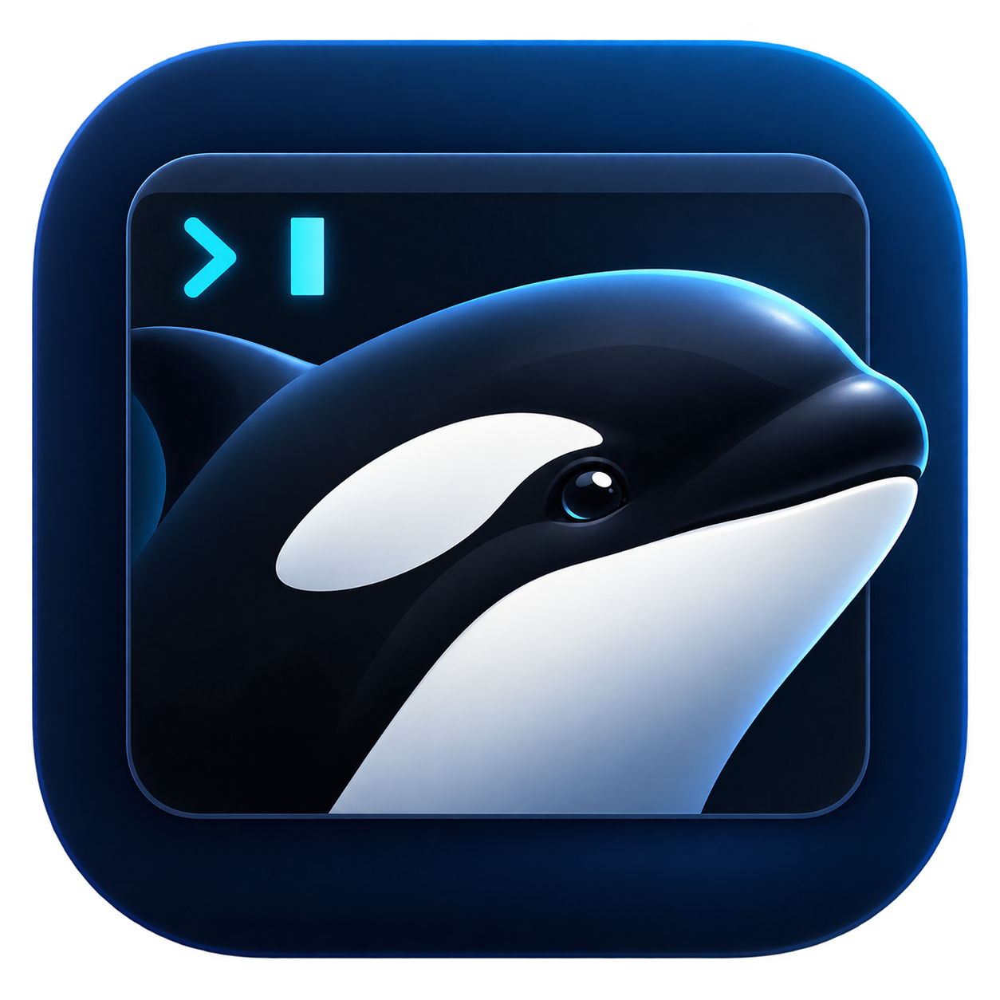

# Orc



Native macOS clients for sessions owned by Orca. The SwiftUI app lists and creates sessions, offers native chat and embedded libghostty views, and copies an attach command for an external terminal. The `orc` CLI lists, creates, and attaches to those same sessions.

Orca owns PTYs, agents, projects, persistence, remote hosts, and mobile access. Orc reuses the selected profile's running runtime. When it is unavailable, Orc starts the installed Orca backend headlessly and waits for it to become ready; no Orca window is needed. The backend stays alive when Orc closes or the CLI exits. Orc does not patch Orca or replace its executable.

Install Orca.app in `/Applications` or `~/Applications`, or set `ORCA_APP_EXECUTABLE` to the absolute path of its `Contents/MacOS/Orca` executable. Concurrent Orc clients coordinate startup per profile, and Orca's own single-instance lock also applies. An existing runtime that is still starting is given time to recover. Orc does not terminate an unresponsive runtime or replay a mutation after sending it. Startup failures include the private log path under `~/.config/orc/runtimes/` (or `ORC_CONFIG_DIR`).

## Use

```sh
orc list
orc projects
orc new
orc new codex
orc new pi --name fleet-rules
orc new terminal --project path:/absolute/path/to/registered/project
orc attach
orc attach fleet-rules
orc attach fleet-rules --read-only
```

Run **`orc new`** to start the configured agent in the configured project and attach to it immediately in an interactive terminal. The defaults are **Codex** and **spiceai-project**. Omitting `--name` generates an unused short **verb-noun** name, such as `glide-mouse`. Choose an agent with `orc new codex`, `orc new claude`, or `orc new pi`; `orc new terminal` starts a shell without an agent. Agent commands must be installed and available to Orca's shell. Use `--command 'COMMAND'` for a custom command instead of a session type. Noninteractive use prints the attach command without opening a terminal; `--json` retains its creation-only output for scripts.

Use **`--project SELECTOR`** to choose another registered project by name, absolute path, `path:/absolute/path`, or `id:ID`. `orc projects` lists available choices. `list`, `projects`, and `new` support `--json`; creation JSON includes the name, type, project, handle, and attach command.

The app and CLI read session defaults from **`~/.config/orc/config.json`**:

```json
{
  "defaultSessionType": "codex",
  "defaultProject": "spiceai-project"
}
```

`defaultSessionType` supports `codex`, `claude`, `pi`, and `terminal`. `defaultProject` accepts the same selectors as `--project`: a registered project name, absolute path, `path:/absolute/path`, or `id:ID`. An explicit CLI type or `--project` overrides the corresponding setting. The app initializes its New Session controls from both defaults and lets you choose another project or agent. A missing or ambiguous project produces an error instead of choosing another project.

Installation creates this file if absent and preserves existing settings. Missing settings fall back to `codex` and `spiceai-project`. Defaults are read each time a session is created from the CLI or picker, and each time the app opens New Session. `ORC_CONFIG_DIR` changes the directory for both configuration and connection credentials.

**Orc.app** opens as a compact session list. Selecting a session reveals its details, a local notes field that saves as you type, and the **Copy Attach Command** button. Click **Attach** to expand the window and start its embedded terminal. While attached, selecting another running session switches the terminal to it automatically. **Detach** returns to details and restores selection without automatic attachment; sessions continue running in Orca. Create a session with **⌘N**, or right-click a session and choose **Rename Session…** to change its name in Orca. Copy uses the stable terminal handle, so duplicate or changing display names cannot attach the wrong session. The CLI accepts an exact handle, a unique handle prefix, or an unambiguous session name.

The bolt button in the sidebar footer toggles auto-attach. When highlighted, selecting a running session opens its terminal immediately; when off, selecting a session shows its details unless you are switching from an existing attachment. Detach always returns to details, and selecting another session while auto-attach is on attaches again. The setting is saved for the next app launch.

Right-click a top-level session and choose **Create Child…** to create a regular Orca session in the parent's project. Enter `review` under `orca-frontend` and Orca saves the name `orca-frontend-review`; Orc's sidebar shows it indented as `review`. Parents with children have a disclosure arrow. Grouping is derived from full Orca names, so renaming an existing session to `orca-frontend-review` groups it the same way, with no separate metadata to migrate. Nesting is limited to one level; a child cannot create children. The child dialog starts with your configured default agent, and its project can be changed before creation.

In an Orca-hosted Pi session, run **`/notes`** to edit the same note in nvim. Orc installs the Pi extension at `~/.pi/agent/extensions/orc-notes.ts`; existing Pi processes can load it with `/reload`. Notes are private local text files in `~/.config/orc/notes/` (or `ORC_CONFIG_DIR/notes/`), keyed by Orca's persistent tab and pane IDs so they survive a terminal-handle change on restart. The app refreshes an open note when nvim saves it. Notes saved by earlier Orc versions in macOS preferences or handle-named files are kept and migrated when their session is opened.

The `orc-session-name.ts` Pi extension keeps Pi's `/name` aligned with the saved Orca tab name. An Orca rename sets the Pi session name; using `/name` in Pi renames the Orca tab. It reads Orca's selected profile and sends tab renames through the installed Orca CLI. Existing Pi processes can load it with `/reload`.

The app and CLI display Orca's saved tab names. Agent title updates do not replace those names. Split panes in the same Orca tab share its name; use a terminal handle when a name matches multiple panes.

In headless mode, Orc also reads saved custom names from the selected Orca profile to handle stale runtime layout titles. Orc never writes Orca's profile files; creating and renaming sessions use its runtime API.

Session indicators show Orca's reported agent activity: green means idle, a yellow spinner means active, and an orange exclamation mark means the agent needs attention. Gray indicates no agent, unavailable activity, or an offline terminal; hover for the status. The list refreshes every two seconds. Chat activity updates through its live metadata stream. Reduce Motion keeps the active indicator yellow without spinning.

Orc sends a macOS notification when an agent it has observed working becomes idle. Click the notification to open that session. Monitoring continues while Orc is running, including with its window closed; quitting Orc stops monitoring. Allow notifications when prompted, or enable Orc in **System Settings → Notifications**. Notifications follow your macOS sound, banner, and Focus settings. Sessions already idle at launch do not trigger alerts, and repeated idle updates do not create duplicates.

Orc's Dock badge counts sessions showing the unread bell state. Viewing a session's chat or attached terminal clears its alert and reduces the count; the badge disappears when none remain. Enable **Badge application icon** for Orc in System Settings → Notifications. Orc requests badge permission when it starts, including for installations that had already allowed banners and sounds.

Choose **Open Chat** for a supported agent's conversation, without starting an embedded terminal. Chat displays messages and expandable tool activity, loads earlier history, and sends with **⌘Return**. **Stop** interrupts the current response; **Attach** switches to its terminal. Closing chat leaves the Orca session running.

Edit tool calls display syntax-highlighted diffs with **Unified** and **Split** layouts, powered by [@pierre/diffs](https://diffs.com/docs). Pi/Claude replacement edits, multi-edits, unified patches, and Codex `apply_patch` calls use the changes recorded in the transcript. Replacement snippets and Codex hunks are labelled as excerpts with relative line numbers. **Tool input** keeps the original arguments accessible; unsupported or incomplete edits use that text view. Previews describe the requested changes, while tool results report whether they succeeded. The renderer is bundled locally and works offline.

Chat uses Orca's `nativeChat` transcript APIs and live agent status. Pi, Claude/OpenClaude, Codex, Grok, and OMP are supported when Orca publishes a provider session ID. The agent's Orca status hooks must work, and startup prompts may need to be completed through Attach before a conversation becomes available. Pi, Grok, and OMP require a locally readable transcript; plain shells and SSH Pi sessions use Attach. Use Attach for permission prompts, interactive questions, slash commands, and image input. A disconnected chat retains its history and draft; click **Reconnect Chat** to resume. Input is never automatically retried after uncertain delivery.

Pi transcripts use Orca's OMP decoder with the exact absolute `.jsonl` path reported by Pi's status hook. Orc keeps the Pi session identity and input target; only the transcript decoder selection is OMP. Chat waits when that path is missing. The decoder displays messages in file order, so a branched or rewound Pi conversation can include abandoned turns; use Attach for Pi's active-branch view.

Run **`orc attach`** without a name to open a terminal session picker. Type to filter names, project paths, or handles; use **↑/↓** to select and **Enter** to attach. **Esc** cancels and **Ctrl-U** clears the filter. Only running sessions appear. `--read-only` and `--no-reconnect` also work with the picker.

Press **`n`** in the picker to create and attach to a session with the same defaults as `orc new`: the configured agent and project, and an autogenerated verb-noun name. This also works when the list is empty or after switching back with **Ctrl+'**. While filtering, `n` is ordinary search text; use **`/`** to begin a search with `n`, or **Ctrl-U** to clear the filter and restore the new-session shortcut.

While attached in Ghostty, press **Ctrl+'** (Control + apostrophe) to return to a refreshed session picker. Choose another session with **↑/↓** and **Enter**, or **Esc** to exit. This also works after `orc attach NAME`; both sessions stay running, and `--read-only`/`--no-reconnect` remain in effect. Ordinary apostrophes and pasted text are sent to the session normally.

When `orc attach` runs in a Herdr pane, the attached Orca agent appears in Herdr's Agents view under its Orca session name. Orc reports Orca's available `working`, `idle`, and attention states to Herdr. When Orca has no activity state, Herdr uses its screen detection for Codex, Claude, or Pi. **Ctrl+'** clears the previous agent from Herdr while the picker is open and shows the newly selected agent after attachment. **Ctrl-]** removes it on detach. This applies only to the session attached in that pane; Orca-only sessions without a Herdr pane do not appear in Herdr's Agents view. Herdr supplies the pane context and CLI path automatically; no Orca changes or Herdr configuration are needed.

When an attached session ends, `orc attach` returns to the refreshed picker automatically. Choose another running session, press **n** to create one, or **Esc** to exit. This also applies when attaching by name or handle; ended sessions are omitted from the picker. Embedded terminals stay bound to their selected session and close their attachment when it ends.

Press **Ctrl-]** to detach. Closing an inline view or the app also detaches; the agent continues in Orca. Attach reconnects after a transport interruption and checks that the terminal's process incarnation has not changed. Use `--no-reconnect` to exit on interruption. Read-only attachment neither sends input nor claims the terminal size.

Attach restores the agent's keyboard mode, including **Shift+Enter** for multiline input in Codex. Modified keys retain their agent-defined behavior across reconnects and session switches.

The scroll wheel uses your terminal's native scrollback for normal-screen sessions. Attach requests up to 5,000 retained lines from Orca, subject to its snapshot size limit. Full-screen applications retain their own alternate-screen and mouse behavior. Detaching leaves normal-screen output in your terminal's scrollback.

### One-time terminal connection

Listing and creation work over Orca's authenticated local Unix socket. Interactive streams additionally require an Orca **runtime access link**:

1. In Orca, open **Settings → Remote Orca Servers**, create an access link for this computer, and copy it. Use runtime sharing, not mobile pairing.
2. Paste it into Orc's **Connection Settings**, or run `orc connect` and paste at its hidden-input prompt.
3. Select a session and click **Attach** in Orc, or run `orc attach NAME` in Ghostty.

Automatic headless startup uses the same Orca profile and existing pairing identity. It does not create a new access link. First-time setup still requires the runtime access link above.

The app and CLI share `~/.config/orc/connection.json`, written with owner-only permissions. Treat runtime access links as credentials. Revoke Orc's dedicated link in Orca to remove its access. Existing phone pairing remains independent. When the phone owns a live terminal, Orca may refuse desktop typing; leave that phone terminal before resuming desktop input.

## Build and install

Requires Apple Silicon, macOS 14+, Python 3.12+, Node.js 20+ with npm, and Xcode with its command-line tools and Metal toolchain. Install the Metal component if necessary:

```sh
xcodebuild -downloadComponent MetalToolchain
bash scripts/build.sh
bash scripts/install.sh
open ~/Applications/Orc.app
```

Build downloads checksum-pinned Zig 0.15.2, Ghostty 1.3.1, and libsodium 1.0.22 into `.build/deps`, and installs the locked diff-renderer dependencies in `WebDiff`. It builds the full embedded libghostty C API, statically links both libraries, bundles Ghostty and diff resources, and ad-hoc signs `dist/Orc.app`. Installation copies the app to `~/Applications/Orc.app` and links `~/.local/bin/orc`. Add `~/.local/bin` to your shell's PATH if needed. Node.js and Homebrew libraries are not required at runtime.

For CLI-only development:

```sh
bash scripts/bootstrap-sodium.sh
ORC_CLI_ONLY=1 swift build --product orc
ORC_CLI_ONLY=1 swift test
```

The Ghostty build creates a private SDK overlay to normalize arm64e TBD entries for Zig 0.15 and repacks Zig archive members before Apple's `libtool` indexes them. It leaves Xcode's SDK untouched. Builds produce an arm64 application for this Mac; release signing/notarization and Intel builds are separate distribution work.

## Architecture and compatibility

`OrcKit` contains session models, local RPC, NaCl-authenticated WebSocket streaming, and terminal attachment. Both frontends use the same session service. Each libghostty surface launches the app's bundled `orc attach` in a local PTY; libghostty handles rendering, input, selection, scrolling, and clipboard operations. The remote PTY remains in Orca.

The adapter requires Orca's `terminal.binary-stream.v1` and `terminal.multiplex.v1` capabilities. It uses internal runtime protocols, which are not a stable third-party SDK. Protocol changes in Orca can require updating this adapter. Ghostty's full embedding API is also pinned rather than assumed stable.

`ORCA_USER_DATA_PATH` selects the local Orca profile, and `ORC_CONFIG_DIR` selects Orc's configuration and credentials. The WebSocket endpoint follows that runtime's metadata, while the saved server public key pins its identity. Remote projects are accessed through the local Orca runtime; this is not a standalone remote-runtime client.

## End-to-end tests

Use a disposable instance of the **installed** Orca executable with `--user-data-dir=/absolute/test/profile --serve --serve-json --serve-port PORT --serve-pairing-address 127.0.0.1`. Its JSON ready event contains a runtime pairing URL: keep that output private. Set `ORCA_USER_DATA_PATH` to the same profile for CLI commands, register the Orc source project and a local `spiceai-project` with `orca repo add --path PATH`, and connect `orc` using a separate `ORC_CONFIG_DIR`.

With those two environment variables set:

```sh
python3 scripts/e2e.py
python3 scripts/e2e-new.py
ORC_CLI_ONLY=1 ORC_LIVE_TESTS=1 ORC_TEST_WORKTREE="$PWD" swift test
```

The PTY suite creates and cleans up only its own sessions. It tests actual stream encryption, input, viewport changes, detach/reattach, concurrent read-only viewing, signal cleanup, and transport reconnection. Picker creation also exercises the installed Codex command and its Orca status hook without sending prompts. The creation suite additionally requires installed Claude and Pi commands with working status hooks. It starts each agent without sending prompts and checks defaults, project selection, names, validation, and cleanup. The opt-in live Swift tests exercise mobile input ownership, desktop viewing, transcript streaming and pagination (including Pi records through Orca's OMP decoder), and guarded chat input against the same real runtime; they do not substitute for testing a physical phone.

Run `npm --prefix WebDiff ci` and `npm --prefix WebDiff test` to check edit/patch parsing against the actual diff library. `npm --prefix WebDiff run build` bundles the renderer for native app development.

An optional live-agent test sends a small prompt and tests interruption against an authenticated disposable Codex session. Set `ORC_LIVE_AGENT_TESTS=1`, `ORC_CHAT_TEST_HANDLE` to an `orc-chat-e2e…` fixture, and `ORC_CHAT_TEST_PROVIDER_FILE` to a private JSON file containing that fixture's verified provider `id` and `transcriptPath`. This isolates message transport from hook discovery; it does not test automatic session identification.

Never point integration tests at your daily Orca profile. Normal `swift test` skips live mutation tests.

For automatic-startup coverage, use an empty disposable runtime profile and isolated client credentials, then run `python3 scripts/e2e-startup.py --restart-test-runtime`. This suite starts and stops that headless runtime, refuses profiles with existing sessions, checks concurrent cold starts and stale discovery files, and verifies that a lost mutation reply does not trigger replay. It leaves the final test runtime running for the other integration suites. Stop that specific test runtime when validation is complete.

`python3 scripts/e2e-session-names.py --restart-test-runtime` uses the same isolated profiles to verify saved names, renaming, and attach-by-name across a backend restart. It requires an empty runtime and cleans up its session and backend on success.

## Upstream

- [Orca CLI](https://www.onorca.dev/docs/cli/reference), [runtime sharing](https://www.onorca.dev/docs/remote-servers), and [native chat](https://www.onorca.dev/docs/agents/native-chat)
- [Ghostty source and embedding API](https://github.com/ghostty-org/ghostty/tree/v1.3.1)
- [libsodium](https://doc.libsodium.org/)
- [@pierre/diffs](https://diffs.com/docs)

Upstream licenses are included in the built app's `Contents/Resources/licenses` directory and `Contents/Resources/DiffView/THIRD-PARTY-NOTICES.txt`.
