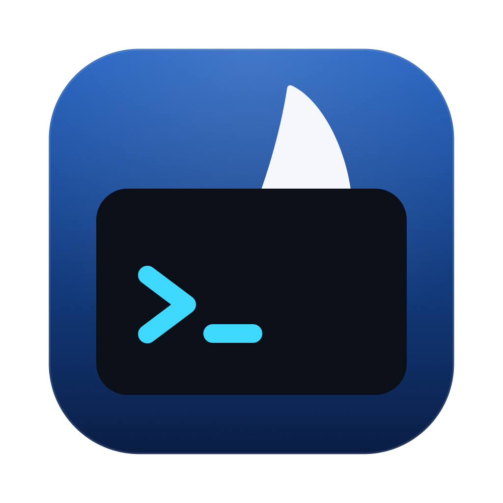

# Orc



Native macOS clients for agent and shell sessions that keep running in the background. The SwiftUI app lists and creates sessions and attaches to them in embedded libghostty views. The `orc` CLI lists, creates, and attaches to those same sessions, and the official Orca mobile app can view and type into them.

Sessions belong to Orc's bundled runtime in `Orc.app/Contents/Resources/Runtime` ([design](slim/README.md)). A small holder process per session owns its program and PTY; a restartable frontend serves the app, the CLI, and phones. Sessions keep running when Orc closes, when the CLI exits, and when Orc is updated.

Runtime state lives in `~/.config/orc/runtime` (or `ORC_CONFIG_DIR/runtime`; `ORC_RUNTIME_DIR` selects another profile). Orc starts the runtime when no frontend serves that profile, and concurrent clients coordinate startup per profile. Startup output goes to a private log under `~/.config/orc/runtimes/` (or `ORC_CONFIG_DIR`).
## Use

```sh
orc list
orc projects
orc projects add /absolute/path/to/project --default
orc new
orc new codex
orc new pi --name fleet-rules
orc new terminal --project path:/absolute/path/to/registered/project
orc attach
orc attach fleet-rules
orc attach fleet-rules --read-only
orc close fleet-rules
```

Run **`orc new`** to start the configured agent in the configured project and attach to it immediately in an interactive terminal. The default agent is **Codex**. Register a project folder with `orc projects add PATH --default`, or select one with `--project`. Omitting `--name` generates an unused short **verb-noun** name, such as `glide-mouse`. Choose an agent with `orc new codex`, `orc new claude`, or `orc new pi`; `orc new terminal` starts a shell without an agent. Agent commands must be installed and available to your login shell. Use `--command 'COMMAND'` for a custom command instead of a session type. Noninteractive use prints the attach command without opening a terminal; `--json` retains its creation-only output for scripts.

Use **`--project SELECTOR`** to choose another registered project by name, absolute path, `path:/absolute/path`, or `id:ID`. `orc projects` lists available choices. `list`, `projects`, and `new` support `--json`; creation JSON includes the name, type, project, handle, and attach command.
The app and CLI read session defaults from **`~/.config/orc/config.json`**:

```json
{
  "defaultSessionType": "codex",
  "defaultProject": "path:/Users/you/code/project"
}
```

`defaultSessionType` supports `codex`, `claude`, `pi`, and `terminal`. `defaultProject` accepts the same selectors as `--project`: a registered project name, absolute path, `path:/absolute/path`, or `id:ID`. An explicit CLI type or `--project` overrides the corresponding setting. The app initializes its New Session controls from both defaults and lets you choose another project or agent. A missing or ambiguous project produces an error instead of choosing another project.

In Orc, **Settings…** (⌘,) sets the default agent and project; changes are saved to this file at once, and other settings in it are kept. A configured project that is not registered is shown as such rather than changed.

Codex sessions launch with `--no-daemon` so tool processes inherit their session's environment and identity. The installed Codex CLI must support that flag.

Agents never stop to ask for approval: Codex launches with `--yolo`, which also turns off its sandbox, and Claude with `--dangerously-skip-permissions`.

Installation creates this file if absent and preserves existing settings. The project must be registered before session creation. Defaults are read each time a session is created from the CLI or picker, and each time the app opens New Session. `ORC_CONFIG_DIR` changes the directory for configuration, connection credentials, and the default runtime profile.

A session's name is its identity. Agents are messaged by name, and notes, board placement, and sidebar order follow the name. Names are 1–64 characters, without `/` or control characters, and cannot start with `.`.

**Orc.app** shows the session list beside the selected session's embedded terminal; selecting another session switches the terminal to it. With no session selected, the terminal's place offers to start a session or open a previous conversation, and the window keeps its size. The terminals of the ten most recently shown sessions stay attached in the background, so switching back to one is immediate and keeps its scrollback, scroll position and selection; a hidden terminal does not draw or resize its session. Sessions keep running either way. **Status** in the toolbar (⌥⌘S) opens a floating panel with the selected session's state, its project and a local notes field that saves as you type, and for an agent session its [status](#agent-status). Create a session with **⌘N**, or right-click a session and choose **Rename Session…** to rename it; its note moves with it. The CLI takes session names.
The session list has a section for each project with sessions, including temporarily disconnected ones, headed by the project and its number of sessions. Click a header to collapse or expand the project; Orc remembers which are collapsed and expands a project when one of its sessions is selected, for example from a notification. A project is placed where its first session is in the sidebar order. Each row shows the session's agent and, for an agent with a [status](#agent-status), its headline. Drag sidebar rows to rearrange sessions within their project. Parents move with their children; children can move within their parent. Sidebar order saves locally per runtime profile under `ORC_CONFIG_DIR/sidebar-order` (default `~/.config/orc/sidebar-order`), and survives app restarts.

Open **Session Overview** with the grid button in the main window or **⇧⌘O** to see what all your sessions are doing. It sorts them by what they need: **Needs You** (an agent at a permission prompt, a finished turn you have not read, an agent whose status says it waits on you, or a check of an agent's [pull request](#agents-pull-requests) that failed again after the agent was told twice), then **Working**, then **Idle**. Each card is a session with the agents it spawned and its named children beneath it, in the lane of its most urgent member. A card shows its project at the top right and a short row for each session: its state and how long it has been in it, queued messages and its next wake, and for an agent its status headline, anything it waits on from you, and its pull requests. Select a session, by clicking it or with ↑/↓ or j/k, to open its full status in its card. **Reply** sends an agent a message, as `orc agent send` does: Return sends it now, steering a working agent; ⌘Return sends it once the agent is idle. **Open**, or a double-click, shows the session in the main window. Return opens the selected session, R replies to it, M marks it read (its new output and what its status says it waits on) and selects the next, Esc closes it, and ? shows these shortcuts over the overview. The toolbar shows Claude's and Codex's usage. Search narrows the overview to sessions whose name, project path, agent or status matches. Viewing the overview leaves unread output marked for review.

Right-click a top-level session and choose **Create Child…** to create a session in the parent's project. Enter `review` under `frontend` and the session is named `frontend-review`; Orc's sidebar shows it indented as `review`. Parents with children have a disclosure arrow. Grouping is derived from full names, so renaming an existing session to `frontend-review` groups it the same way, with no separate metadata. Nesting is limited to one level; a child cannot create children. The child dialog starts with your configured default agent, and its project can be changed before creation.

In a Pi session started by Orc, run **`/notes`** to edit the session's note in nvim. Orc installs the Pi extension at `~/.pi/agent/extensions/orc-notes.ts`; existing Pi processes can load it with `/reload`. Notes are private text files named after their session in `~/.config/orc/notes/` (or `ORC_CONFIG_DIR/notes/`). The app refreshes an open note when nvim saves it.

The `orc-session-name.ts` Pi extension gives a Pi session its Orc session's name when it starts. Pi's `/name` does not rename the Orc session. Existing Pi processes can load it with `/reload`.

The app installer registers Claude Code `SessionStart` and `UserPromptSubmit` hooks in `~/.claude/settings.json` (or `CLAUDE_CONFIG_DIR`), preserving other hooks and settings. Inside an Orc session, they set Claude's title to the session's name using the documented [`hookSpecificOutput.sessionTitle`](https://code.claude.com/docs/en/hooks#sessionstart-decision-control) field, on startup, resume, fork, and each submitted prompt. A running program keeps the name its session had when it started. Claude sessions outside Orc are unaffected. This requires Claude Code 2.1.152 or later; restart existing Claude sessions after installing the hooks. The hook command is `orc hook claude-session-name` and reads Claude's hook JSON from stdin.

Session indicators show each agent's status as reported by its hooks: green means idle, a yellow spinner means active, and an orange exclamation mark means the agent needs attention. Gray indicates no agent, unavailable activity, or an offline terminal; hover for the status. The list refreshes every two seconds. Reduce Motion keeps the active indicator yellow without spinning.
Orc sends a macOS notification when an agent it has observed working becomes idle. Click the notification to open that session. Monitoring continues while Orc is running, including with its window closed; quitting Orc stops monitoring. Allow notifications when prompted, or enable Orc in **System Settings → Notifications**. Notifications follow your macOS sound, banner, and Focus settings. Sessions already idle at launch do not trigger alerts, and repeated idle updates do not create duplicates.

Orc's Dock badge counts sessions showing the unread bell state. Viewing a session's attached terminal clears its alert and reduces the count; the badge disappears when none remain. Enable **Badge application icon** for Orc in System Settings → Notifications. Orc requests badge permission when it starts, including for installations that had already allowed banners and sounds.

To silence an agent session, right-click it in the session list and choose **Mute Notifications**. A muted session posts no idle notifications, is left out of the Dock badge, and shows a muted bell instead of its activity light. Muting follows the session when it is renamed in Orc, reopened or restored; it is forgotten once no running or recently closed session has the name.

When Ghostty is installed, or you have a Ghostty configuration file, Orc's terminals use your Ghostty settings: theme, font, colors, padding and keybinds, from the same configuration files Ghostty reads. A theme with light and dark variants follows the system appearance. A `background-opacity` below 1 makes the terminal translucent, with your `background-blur`; the rest of the window stays opaque. Without Ghostty, terminals use Orc's defaults (Menlo 13, GitHub Dark). Either way, Orc keeps `confirm-close-surface = false` and `shell-integration = none`, which its terminals depend on. Ghostty's reload-configuration keybind reloads the settings in Orc too; otherwise they are read when Orc starts.

Click a local Markdown link in an attached terminal to open a separate Orc window. **Rendered** is selected by default; **Raw** shows the read-only source. **Reload file** reads changes saved on disk. Links to other Markdown files open their own windows, while web links use your browser. Relative links in a terminal resolve from the session's project folder; links inside a document resolve from that file's folder. The offline renderer does not execute embedded scripts or fetch remote images. Local images must be inside the document's folder. Markdown files must be UTF-8 and at most 4 MiB.

Dropping local files or images into an attached terminal pastes their quoted paths without pressing Enter. Dropped image data without a file path is saved as private PNG files under `ORC_CONFIG_DIR/attachments` (default `~/.config/orc/attachments`), up to 20 MiB per image. Keep these files while agents or resumed conversations may need them.

Run **`orc attach`** without a name to open a terminal session picker. Type to filter names or project paths; use **↑/↓** to select and **Enter** to attach. **Esc** cancels and **Ctrl-U** clears the filter. Only running sessions appear. `--read-only` and `--no-reconnect` also work with the picker.

Press **`n`** in the picker to create and attach to a session with the same defaults as `orc new`: the configured agent and project, and an autogenerated verb-noun name. This also works when the list is empty or after switching back with **Ctrl+'**. While filtering, `n` is ordinary search text; use **`/`** to begin a search with `n`, or **Ctrl-U** to clear the filter and restore the new-session shortcut.

While attached in Ghostty, press **Ctrl+'** (Control + apostrophe) to return to a refreshed session picker. Choose another session with **↑/↓** and **Enter**, or **Esc** to exit. This also works after `orc attach NAME`; both sessions stay running, and `--read-only`/`--no-reconnect` remain in effect. Ordinary apostrophes and pasted text are sent to the session normally.
When `orc attach` runs in a Herdr pane, the attached agent appears in Herdr's Agents view under its session name. Orc reports the agent's `working`, `idle`, and attention states to Herdr. When the agent reports no state, Herdr uses its screen detection for Codex, Claude, or Pi. **Ctrl+'** clears the previous agent from Herdr while the picker is open and shows the newly selected agent after attachment. **Ctrl-]** removes it on detach. This applies only to the session attached in that pane; sessions without a Herdr pane do not appear in Herdr's Agents view. Herdr supplies the pane context and CLI path automatically; no Herdr configuration is needed.

When an attached session ends, `orc attach` returns to the refreshed picker automatically. Choose another running session, press **n** to create one, or **Esc** to exit. This also applies when attaching by name; ended sessions are omitted from the picker. Embedded terminals stay bound to their selected session and close their attachment when it ends.
Press **Ctrl-]** to detach. Closing an inline view or the app also detaches; the agent keeps running. Attach reconnects after a transport interruption and checks that the terminal's process incarnation has not changed. Use `--no-reconnect` to exit on interruption. Read-only attachment neither sends input nor claims the terminal size.

Attach restores the agent's keyboard mode, including **Shift+Enter** for multiline input in Codex. Modified keys retain their agent-defined behavior across reconnects and session switches.
The scroll wheel uses your terminal's native scrollback for normal-screen sessions. Attach requests up to 5,000 retained lines, subject to the runtime's snapshot size limit. Full-screen applications retain their own alternate-screen and mouse behavior. Detaching leaves normal-screen output in your terminal's scrollback.

## Agents

Agents are sessions addressed by name. An agent can spawn and message others:

```sh
orc agent spawn codex fix-ci --project spiceai-project < brief.md
orc agent send fix-ci < followup.md
orc agent send fix-ci --when-idle < next-task.md
orc agent wait fix-ci
orc agent list
orc agent status fix-ci
orc close fix-ci
```

Spawn starts the agent in `--project` (or the current directory), waits until it is ready, and types the prompt exactly as given. Without an agent (`orc agent spawn fix-ci`), it starts the default agent, as `orc new` does. Send types a message that begins with a line naming the sender (`[from NAME]`, from the calling session's `ORC_SESSION_NAME`). A working agent reads it at its next step, after the tool call it is running; an idle agent starts a turn with it. With `--when-idle`, the message waits until the agent is idle and starts a turn of its own. Messages wait while the agent is at a permission prompt or dialog. Wait returns once the agent has finished everything sent to it. `orc close NAME` ends a session, agent or shell; a closed agent session can be [reopened](#recently-closed-agents). Codex and Claude accept `--model` and `--effort`. See `orc agent --help`.

**Durable agents (experimental).** `orc new durable` or `orc agent spawn durable NAME` starts Orc's own agent, built on [pi-durable](https://www.npmjs.com/package/@earendil-works/pi-durable). It signs in with Pi's credentials (`pi /login`), uses Pi's default model unless given `--model PROVIDER/ID` (Pi's custom providers in `models.json` work too) and offers the models you scoped in Pi with `/scoped-models`, and keeps its conversation in a database, so it continues mid-turn after a crash or a restart. Orc shows it as a chat instead of a terminal: the **View** menu in the toolbar switches between the chat views and the terminal. Messages sent while it works steer it; `--when-idle` messages wait in its queue, where the chat view can withdraw them. In the Orca phone app it opens in the native chat view, shown as a Pi agent. When an Orc update changes the durable agent, running durable agents restart on the new code at their next idle moment and continue their conversations.

An agent can also have a message sent to itself later:

```sh
orc wake 30m "check the CI run"
orc wake pid 4242 "the build finished"
orc wake ./watch-ci.sh "CI finished"
orc wake list
orc wake cancel 1a2b3c4d
```

A wake's message begins with `[from wake]` and is sent as `orc agent send` sends one, so a working agent reads it at its next step. A timer's message defaults to `continue`; a process or script wake adds the exit status, and a script wake adds the end of the script's output. The script runs in the background right away, in the current directory with the session's environment. Wakes survive runtime restarts; ending the session removes them and stops their scripts. See `orc wake --help`.

Every session starts with `ORC_SESSION_NAME` (its name) and `ORC_RUNTIME_DIR` (its runtime profile), so `orc` run inside a session reaches the same runtime and identifies its caller.

### Runtime access

The first time Orc starts or reaches a runtime, it requests its own access grant over the runtime's owner-only local socket and saves it in `~/.config/orc/connection.json` with owner-only permissions. The saved connection is bound to its runtime profile and server key.

### Pair a phone

In Orc, choose **Pair Phone…** from the menu or click the phone icon below the session list. Select your Mac's LAN or Tailscale address and click **Generate QR Code**. On the same Wi-Fi or Tailscale network, open the official Orca Mobile app, choose **Pair**, and scan the code. **Copy Link** provides the alternative paste-pair flow.
```sh
orc pair-phone                         # QR code, preferring Tailscale when available
orc phones                             # Addresses, paired phones, and pending grants
orc pair-phone --address 100.64.1.20    # Choose one of this Mac's listed addresses
orc pair-phone --link                  # Private link for pasting into Orca Mobile
orc pair-phone --rotate                # Replace the unused code; paired phones keep access
orc phones revoke DEVICE_ID           # Disconnect and revoke that phone
```

`pair-phone` and `phones` accept `--json` for automation. Pairing output contains a credential; keep it private. Reopening pairing reuses an unused grant, while pairing another phone after a successful connection creates a separate grant. The app displays paired and pending grants under **Phone Access** and can revoke either. Creating, replacing, and revoking phone grants leave running sessions and Orc's local access intact. Grants persist across runtime restarts.

The runtime listens on port 6768 on every interface. Pairing does not use Orca Relay; both devices need a reachable private network path and the Mac must remain awake. Push notifications to the phone are not supported.

### Agent usage

**Usage**, below the sessions, shows how much of each Claude and Codex subscription limit is used: the five-hour session, the week, and weekly limits on one model, each with its share used and the time until it resets. Shares turn orange from 60% and red from 80%. Collapsed, it shows each agent's highest share. An agent that is not installed or not signed in to a subscription is left out.

The runtime reads usage with the agents' own sign-ins: Claude Code's from the Keychain (or `.credentials.json` in its config directory), and Codex's through `codex app-server`, else the ChatGPT endpoint with `~/.codex/auth.json`. Neither sign-in is changed; an expired Claude sign-in recovers the next time `claude` runs. Usage is checked when Orc becomes active and every 15 minutes while it is, and refetched only once it is 5 minutes old; the refresh button fetches it now. After a failure, the last usage stays visible with a warning for 30 minutes, or a day when the provider rate limited the request.

### Agent status

Orc keeps a short status of each agent session: its goal, its progress, what it is doing right now, its next three steps, and anything it is waiting on from you. A model you choose under Settings → **Agent Status** (one of Pi's scoped models; off until chosen) writes it from the agent's own transcript, starting from the agent's latest summary of its conversation, so the agent is never messaged and its context is untouched. A status is written about 20 seconds after an agent's turn ends or it stops for permission, and every 15 minutes while it works, when its transcript changed; automatic statuses for a session are at least 5 minutes apart, and one is written at a time.

The sidebar shows each agent's status headline after its agent. **Status** (⌥⌘S) shows the full status, with a button to write a new one now, in a floating translucent panel that you can drag anywhere, for example beside the agent's transcript; it follows the selected session, takes keyboard focus only for its notes, hides while Orc is in the background, and closes with its close button or Esc. Coming back to an agent session after 15 minutes away, when its status is newer than your last look, opens the panel by itself; Settings turns that off.

```sh
orc brief cayenne-caching-cdc            # The latest status
orc brief cayenne-caching-cdc --refresh  # Write a new one now and print it
orc brief --eval                         # Check the status model on sample statuses
```

Choosing a status model checks it first: Orc asks it for four sample statuses, from transcripts of an agent that opened a pull request, one that pushed to another, one asking you a question, and one at work, and grades each answer by fixed rules (a well-formed status with three next steps, the question noticed, the right pull requests reported and no others). Settings shows what it got wrong, with **Check Again**; `orc brief --eval [PROVIDER/MODEL]` runs the same checks from the terminal.

Statuses are kept in the runtime profile under `briefs/`, the model in `brief-settings.json`, and each model's checks in `brief-evals.json`.

### Agents' pull requests

Writing an agent's status also links the GitHub pull requests the agent opened or pushes commits to: the status model reports each one it finds in the agent's transcript, and Orc links it when the transcript names it, it is open, and you (as `gh` is signed in) opened it. A pull request belongs to one agent; one that a coordinator and an agent it started both report goes to the latter. Orc then checks each linked pull request on GitHub every 3 minutes, without a model, until it is merged or closed.

Once the agent has been idle for 30 seconds with nothing queued, Orc sends it a message, as `orc agent send` does, about what is new: checks of the latest commit that failed, unresolved Copilot review comments, and merge conflicts. It waits for the commit's other checks to finish first, or until a failure is 15 minutes old. Each finding is reported once, and a check once per commit, so an agent that leaves a check red is not told again until it pushes. Checks named under Settings → **Pull Requests** → **Ignored checks** (Attestation unless you change it; `*` matches anything) are never reported. A check that fails again after the agent was told about it on two commits in a row goes to you instead: the agent's session moves to **Needs You** in the overview, where **Ignore Check** adds it to the ignored checks and **Keep Telling Agent** reports it to the agent every time it fails.

The overview shows each agent's pull requests under it, and the status panel shows each in full, with when the agent was last told.

```sh
orc pr                                                         # Every agent's pull requests
orc pr fix-ci                                                  # One agent's
orc pr watch fix-ci https://github.com/OWNER/REPO/pull/123      # Link one yourself, from another agent if need be
orc pr unwatch fix-ci OWNER/REPO#123
```

Linked pull requests are kept in the session's directory and stay linked when a closed session is reopened; the ignored checks are kept in the runtime profile's `pull-request-settings.json`.

### Recently closed agents

Agent sessions closed in the last week can be reopened, resuming their conversations with their undelivered messages and wakes. In Orc, they are listed under **Recently Closed** below the sessions: click one to reopen it and attach, hover to see its last reply and screen, or choose **Reopen with New Name…** from its menu. **Reopen Closed Session** (⇧⌘T) reopens the most recent one. `orc attach`'s picker lists them after the running sessions.

```sh
orc history                    # Agent sessions closed in the last week, and recent conversations
orc reopen remove-dep          # Reopen one under its name and attach
orc reopen remove-dep --name remove-dep-2
```

Terminal sessions are not listed. A session that is reopened, or whose name is in use again, leaves the list.

### Agent conversations

**Open…** (⌘K) searches recently closed agent sessions and every Codex, Claude and Pi conversation in the agents' own histories, including ones started outside Orc. Conversations in registered projects are searched unless **All projects** is checked. Every word typed must appear in the title, first prompt, last reply or folder. The preview shows the first prompt and last reply; ↵ opens the selection in a new session in its folder, resuming the conversation and named after its title, and ⌥↵ asks for a name first. A conversation that a running session already has open switches to that session instead, and one that belongs to a recently closed session reopens that session. Close a conversation that is open in another app or terminal before opening it in Orc.

```sh
orc history cache flaky        # Closed sessions and conversations matching every word
orc history --all              # Include conversations outside registered projects
orc reopen 01a0f112-21e6       # Open a conversation by its id or the start of it
```

### Restarting your Mac

A restart ends every session. The next time Orc or `orc` starts the runtime, the sessions that were running come back under the same names: agents continue their conversations with their queued messages and wakes, and shells start in the same directory. Sessions running any other command stay ended. Logging out without restarting does not restore sessions.

## Build and install

Requires Apple Silicon, macOS 14+, Python 3.12+, npm, and Xcode with the macOS SDK. The app icon's source is `Resources/AppIcon.svg`; after editing it, render the PNG the build uses with `swift scripts/render-icon.swift Resources/AppIcon.svg Resources/AppIcon.png 1024`. Install the Metal component if necessary:

```sh
xcodebuild -downloadComponent MetalToolchain
bash scripts/build.sh
bash scripts/install.sh
open /Applications/Orc.app
```

Build downloads checksum-pinned Zig 0.15.2, Ghostty 1.3.1, libsodium 1.0.22, and Node.js 24.21.0 into `.build/deps`, and installs the locked Markdown renderer dependencies in `WebMarkdown`. It builds libghostty and the session holder, bundles the runtime (Node.js, the frontend with its production dependencies, and the holder), and signs `dist/Orc.app` ad hoc. Installation verifies and atomically replaces the bundle at `/Applications/Orc.app`, links `~/.local/bin/orc`, and restarts the runtime frontend so the new version serves the existing sessions; sessions keep running. Reopen Orc to load the updated interface. Pi extensions are included in the app. Homebrew libraries and a system Node.js are not required at runtime.

Use `bash scripts/build.sh --offline` with prepared native dependencies and npm cache. `bash scripts/install.sh --offline` installs an existing bundle without building or downloading. `ORC_INSTALL_ROOT` selects an alternate installation root for testing, placing the app in `$ORC_INSTALL_ROOT/Applications` and user files under that same root. This development signing configuration is not a notarized public distribution.
For CLI-only development:

```sh
bash scripts/bootstrap-sodium.sh
ORC_CLI_ONLY=1 swift build --product orc
ORC_CLI_ONLY=1 swift test
```

The Ghostty build creates a private SDK overlay to normalize arm64e TBD entries for Zig 0.15 and repacks Zig archive members before Apple's `libtool` indexes them. It leaves Xcode's SDK untouched. Builds produce an arm64 application for this Mac; release signing/notarization and Intel builds are separate distribution work.

## Architecture and compatibility

`OrcKit` contains session models, local RPC, NaCl-authenticated WebSocket streaming, and terminal attachment. Both frontends use the same session service. Each libghostty surface launches the app's bundled `orc attach` in a local PTY. Ghostty 1.3.1 rebuilds a new surface's configuration from its files when the configuration's light/dark state differs from the app's, which drops the surface's command, so Orc applies the configuration again whenever the appearance changes; libghostty handles rendering, input, selection, scrolling, and clipboard operations. The PTY belongs to the session's holder in the runtime.

The runtime speaks Orca's protocols so the Orca mobile app works unmodified; Orc requires its `terminal.binary-stream.v1`, `terminal.multiplex.v1`, and `orc.agents.v1` capabilities. These are internal protocols, not a stable third-party SDK. Ghostty's full embedding API is also pinned rather than assumed stable.

`ORC_CONFIG_DIR` selects Orc's configuration, credentials, and default runtime profile; `ORC_RUNTIME_DIR` selects another runtime profile. `ORC_RUNTIME_EXECUTABLE` is a development override for the runtime executable, which Orc starts with `--profile DIR`. The WebSocket endpoint follows the runtime's metadata, while the saved server public key pins its identity.

## Tests

`swift test` runs unit tests and skips live ones. `npm --prefix slim/frontend test` runs the runtime's suite; see [slim/README.md](slim/README.md) for its opt-in agent tests. `python3 -m unittest discover -s scripts/tests` covers the build and install scripts.

Run `npm --prefix WebMarkdown ci` and `npm --prefix WebMarkdown test` for Markdown renderer tests. `npm --prefix WebMarkdown run build` bundles the Markdown view for native app development. Build these assets before `swift test` to exercise the Markdown windows with WebKit.

For the live suites, start a disposable runtime and point Orc at it with separate profiles:

```sh
export ORC_RUNTIME_DIR=/tmp/orc-e2e/runtime ORC_CONFIG_DIR=/tmp/orc-e2e/config
node slim/frontend/src/main.ts --profile "$ORC_RUNTIME_DIR" --port 0 &
python3 scripts/e2e.py
python3 scripts/e2e-new.py
ORC_LIVE_TESTS=1 ORC_TEST_WORKTREE="$PWD" swift test
```

The PTY suite creates and cleans up only its own sessions. It tests actual stream encryption, input, viewport changes, detach/reattach, concurrent read-only viewing, signal cleanup, and transport reconnection. Picker creation also exercises the installed Codex command without sending prompts. The creation suite additionally requires installed Claude and Pi commands. It starts each agent without sending prompts and checks defaults, project selection, names, validation, and cleanup. Never point these suites at your daily profile.

## Upstream

- [Ghostty source and embedding API](https://github.com/ghostty-org/ghostty/tree/v1.3.1)
- [libsodium](https://doc.libsodium.org/)
- [Node.js](https://nodejs.org/)

Upstream licenses are included in the built app's `Contents/Resources/licenses` directory, `Contents/Resources/MarkdownView/THIRD-PARTY-NOTICES.txt`, and the runtime's `frontend/node_modules`.
