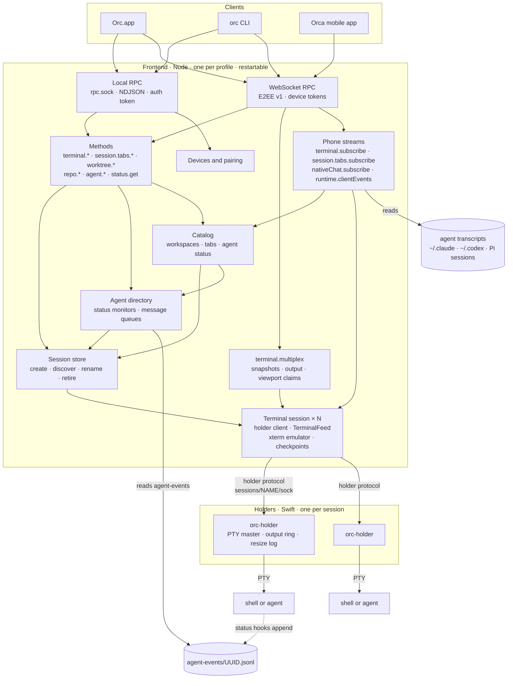
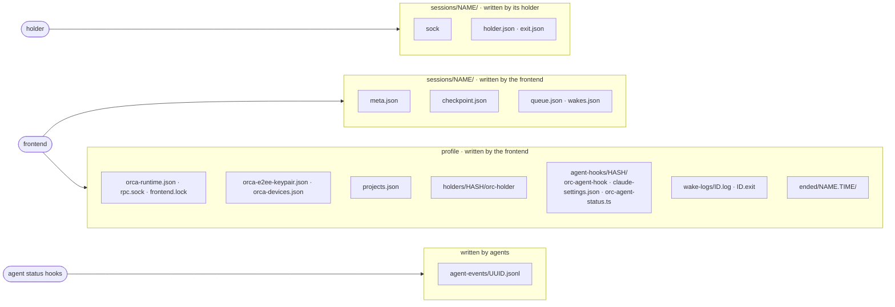
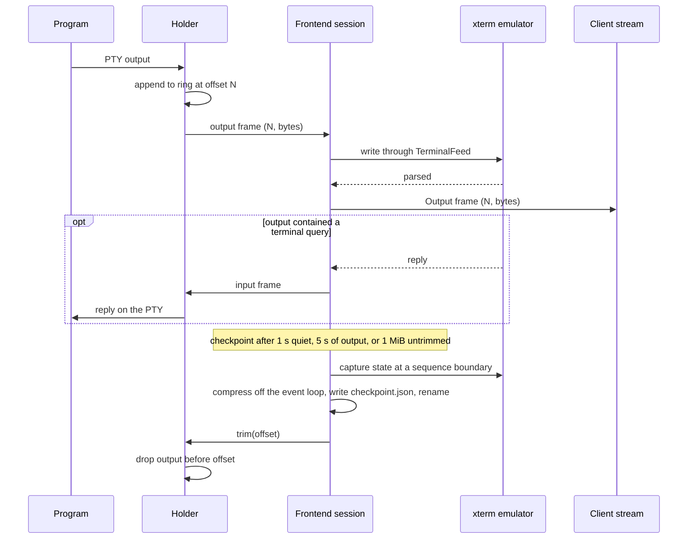
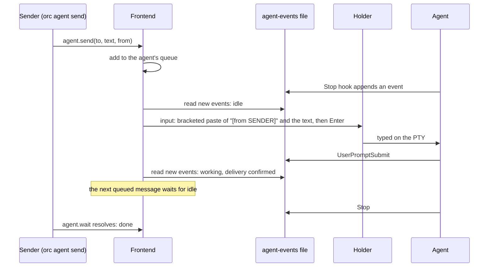
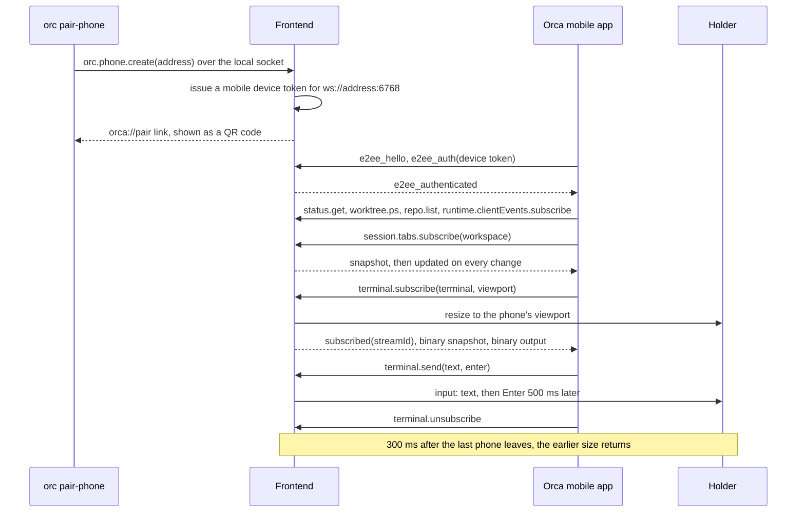
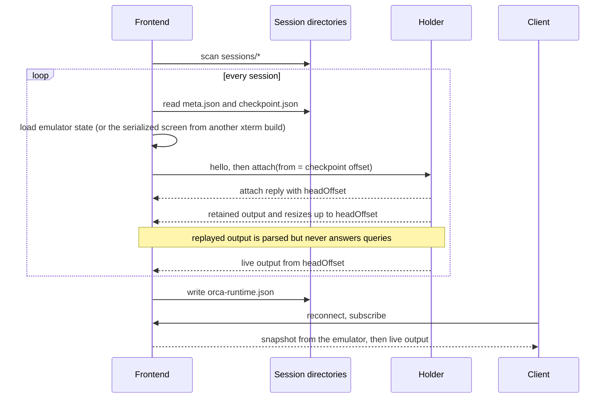
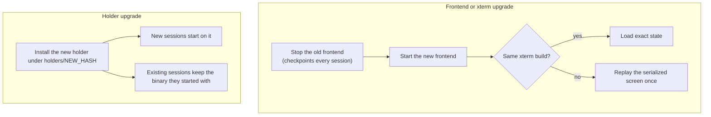

# Slim runtime architecture

The runtime has two kinds of processes. A **holder** per session owns the PTY and the program running
in it, and nothing else. One **frontend** per profile owns every protocol, the terminal emulators and all
persistent state. The frontend can be stopped, crash or be replaced at any time; programs keep running
and the next frontend rebuilds its view of them from the holders.

## Processes

| | Holder | Frontend |
|---|---|---|
| Lifetime | The session | Until stopped or upgraded |
| Owns | PTY master, child process, untrimmed output, resize log | Names, metadata, emulators, checkpoints, projects, devices, keys |
| Parses terminal output | Never | Always, with `@xterm/headless` |
| Changes when | The holder protocol or PTY handling changes | Anything else changes |
| Stopping it | Ends that session | Ends nothing |

## State on disk

The session directory's name is the session's identity. A holder writes only its socket and its own
records, relative to a descriptor for the directory, so renaming the directory does not disturb it.

## Output and checkpoints

A checkpoint holds xterm's exact internal state for the build that wrote it, plus a serialized screen
with 500 rows of scrollback that any build can replay. Output after the checkpoint stays in the
holder's ring until the next checkpoint trims it.

## Agent status and messages

Hooks and the Pi extension are supplied on the agent's command line when it starts, and write only to
the event file named by `ORC_AGENT_EVENTS`. The frontend derives each agent's state from that file, so
a frontend that starts later replays it and reaches the same state.

## Phones

A mobile device token reaches only the methods the Orca app uses. The app's chat view, served to phones
only, reads the agent's own transcript file, located from the session id and path its hooks reported,
and follows it as it grows.

## Frontend start

A session whose holder no longer answers is retired to `ended/` as lost, or as exited when the holder
left `exit.json`.

## Upgrades

## Failure behavior

| Event | Effect |
|---|---|
| Frontend crashes or is killed | Programs keep running. The next frontend replays from each checkpoint plus the holder's retained output; clients reconnect and receive a fresh snapshot. |
| A program queries the terminal while no frontend runs | The query goes unanswered. |
| A holder crashes | Its program loses its terminal and the session ends; the frontend retires it as lost. |
| Untrimmed output exceeds the holder's ring | The oldest output is dropped; the next attach reports a gap. |
| A client reads too slowly | The holder disconnects it; the client reattaches from its last offset. |
| A session name is taken | Creation fails; names are unique per profile. |
| An agent runs while no frontend runs | Its hooks keep appending events; the next frontend replays them. Queued messages wait in `queue.json`. |
| A wake's condition is met while no frontend runs | The next frontend fires it. A wake script keeps running and records its exit status for that frontend. |
| A message cannot be confirmed within 20 s | The next queued message may be delivered; the agent reports an unconfirmed delivery. |
| An agent was started without Orc's hooks | It reports no agent state. |
| The frontend restarts while a phone is connected | The phone reconnects to the same port and resubscribes; its tab snapshots start a new publication epoch. |
| A phone stops viewing a terminal | The PTY takes the next viewing phone's size, or its size from before the first phone. A resize from elsewhere in the meantime stands. |
