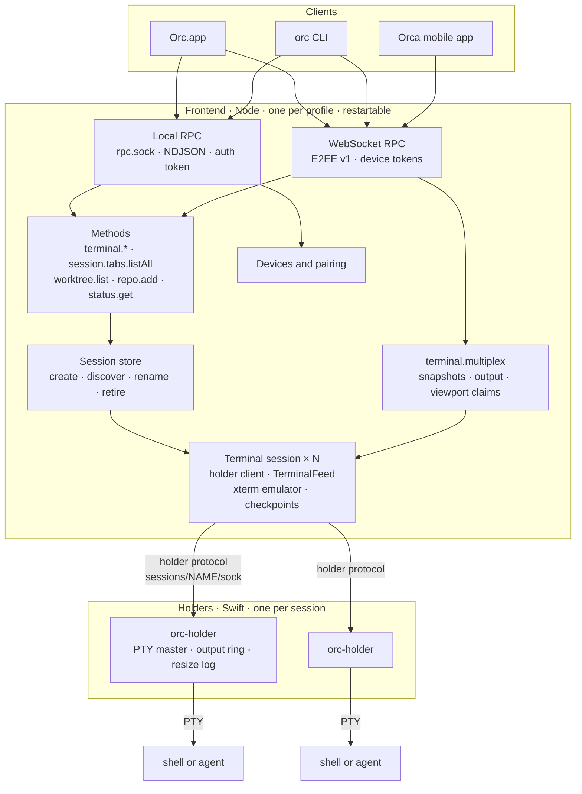
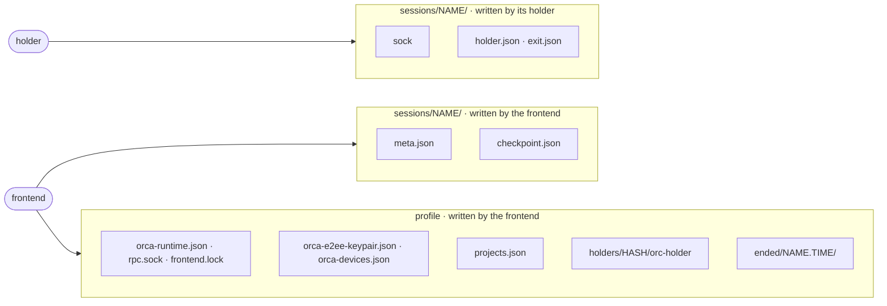
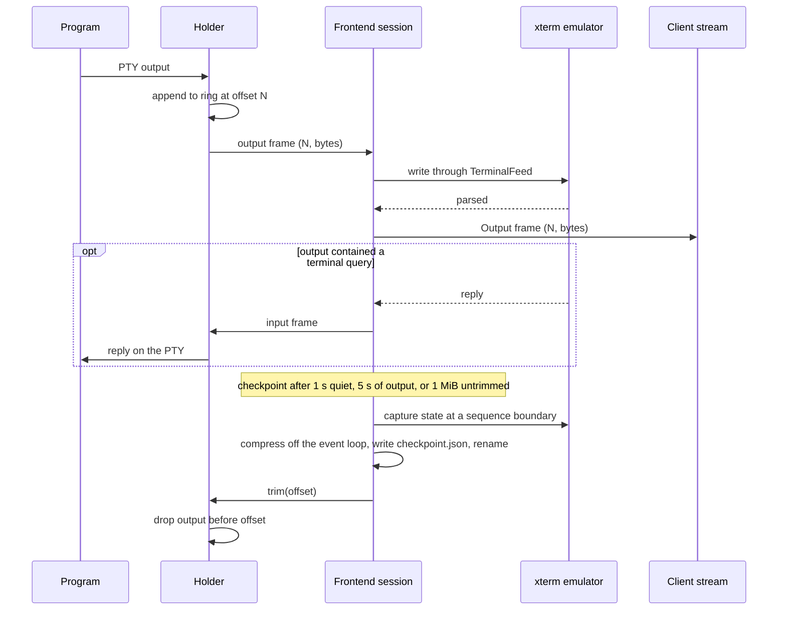
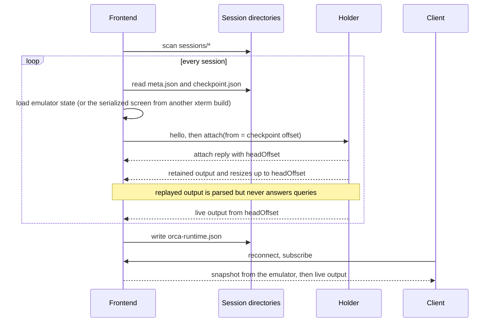
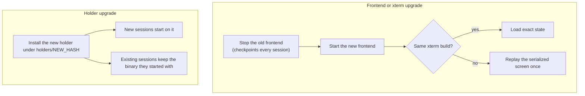

# Slim runtime architecture

The runtime has two kinds of processes. A **holder** per session owns the PTY and the program running
in it, and nothing else. One **frontend** per profile owns every protocol, the terminal emulators and all
persistent state. The frontend can be stopped, crash or be replaced at any time; programs keep running
and the next frontend rebuilds its view of them from the holders.

## Processes

| | Holder | Frontend |
|---|---|---|
| Lifetime | The session | Until stopped or upgraded |
| Owns | PTY master, child process, untrimmed output, resize log | Names, metadata, emulators, checkpoints, projects, devices, keys |
| Parses terminal output | Never | Always, with `@xterm/headless` |
| Changes when | The holder protocol or PTY handling changes | Anything else changes |
| Stopping it | Ends that session | Ends nothing |

## State on disk

The session directory's name is the session's identity. A holder writes only its socket and its own
records, relative to a descriptor for the directory, so renaming the directory does not disturb it.

## Output and checkpoints

A checkpoint holds xterm's exact internal state for the build that wrote it, plus a serialized screen
with 500 rows of scrollback that any build can replay. Output after the checkpoint stays in the
holder's ring until the next checkpoint trims it.

## Frontend start

A session whose holder no longer answers is retired to `ended/` as lost, or as exited when the holder
left `exit.json`.

## Upgrades

## Failure behavior

| Event | Effect |
|---|---|
| Frontend crashes or is killed | Programs keep running. The next frontend replays from each checkpoint plus the holder's retained output; clients reconnect and receive a fresh snapshot. |
| A program queries the terminal while no frontend runs | The query goes unanswered. |
| A holder crashes | Its program loses its terminal and the session ends; the frontend retires it as lost. |
| Untrimmed output exceeds the holder's ring | The oldest output is dropped; the next attach reports a gap. |
| A client reads too slowly | The holder disconnects it; the client reattaches from its last offset. |
| A session name is taken | Creation fails; names are unique per profile. |
